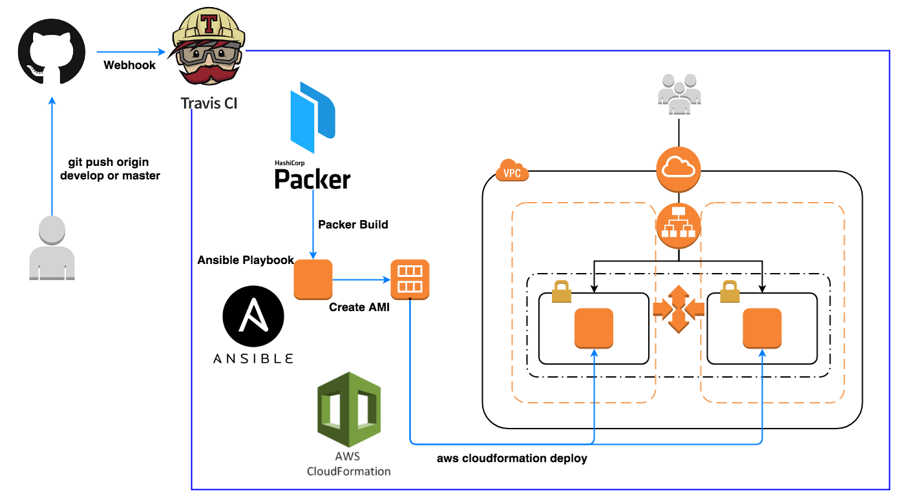

# AWS環境にRails環境を自動構築するためのフレームワーク

RailsのアプリケーションをAWS上に自動構築します。
PackerはAnsibleのPlaybookによって記述されたミドルウェアをインストールした後、AMI(Amazon Machine Image)を作成します。
作成されたAMIはCloudformationのパラメータに引き渡され、新しい環境にデプロイが行われます。

一連の処理はTravis CIによって自動的に行われます。

- developブランチ：dev環境にデプロイ
- masterブランチ：prod環境にデプロイ

まずはdevelopブランチ上で作業を行い、dev環境上でCloudformationおよびAnsibleの動作が問題ないことを確認しましょう。developブランチをGithubにPUSHすると環境構築が自動的に行われます。

問題がなければmasterにマージすればprod環境にデプロイが行われます。



## 使用する技術スタック
- Rails
- Travis CI
- Packer
- Ansible
- Cloudformation

## 注意事項

- SpotInstanceを利用しているため、CloudformationによるAWSリソースの構築の際、まれにEC2インスタンスが確保できずタイムアウトになる可能性があります。まずはVPC, Subnetだけ構築してからAutoScalingグループを構築すると良いかもしれません。お金に余裕がある人は以下の行を削除しましょう。確実にインスタンスを作成することができます。
```diff
 # Prodcution環境ではオンデマンドインスタンスを採用する
 # それ以外の環境ではスポットインスタンスを使用する
+# SpotPrice: !If [ CreateProdResources, !Ref "AWS::NoValue", 0.06 ]
```
